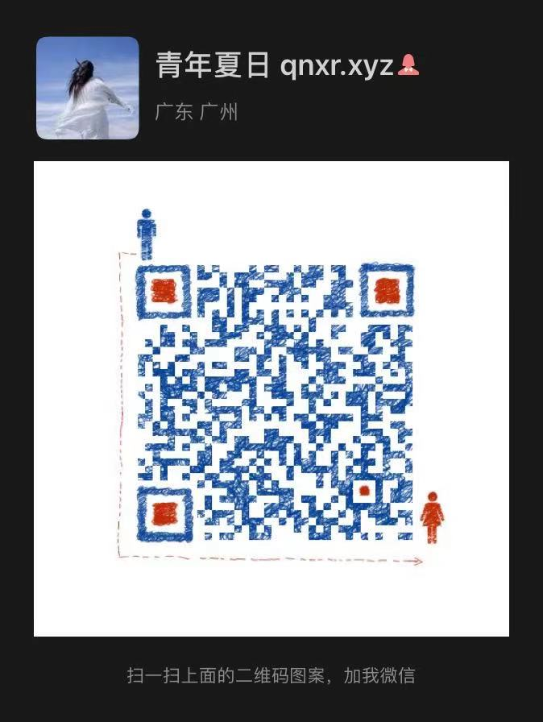

**如果帮到您请给个 star ✨✨✨，您的 star 是我最大的鼓励！**

# Yolov5 keras 漂浮物检测 万能运行 数据集制作
## 实验指标
### yolov5s 为基础训练，`epoch = 50`
|分类|P|R|mAP0.5|
|---|---|---|---|
|总体|0.884|0.899|0.888|
|人体|0.846|0.893|0.877|
|头|0.889|0.883|0.871|
|安全帽|0.917|0.921|0.917|

对应的**权重文件**：[百度云](https://pan.baidu.com/s/1ELPhtW-Q4G8UqEr4YrV_5A)，提取码: `b981`

---

### yolov5m 为基础训练，`epoch = 100`
|分类|P|R|mAP0.5|
|---|---|---|---|
|总体|0.886|0.915|0.901|
|人体|0.844|0.906|0.887|
|头|0.9|0.911|0.9|
|安全帽|0.913|0.929|0.916|

对应的**权重文件**：[百度云](https://pan.baidu.com/s/10hlKrgpxVsw4d_vHnPHwEA)，提取码: `psst`

---

### yolov5l 为基础训练，`epoch = 100`
|分类|P|R|mAP0.5|
|---|---|---|---|
|总体|0.892|0.919|0.906|
|人体|0.856|0.914|0.897|
|头|0.893|0.913|0.901|
|安全帽|0.927|0.929|0.919|

对应的**权重文件**：[百度云](https://pan.baidu.com/s/1iMZkRNXY1fowpQCcapFDqw)，提取码: `a66e`

---

# 1.环境准备
首先确保自己的环境：

```text
    pip install -i https://pypi.douban.com/simple/ --trusted-host=pypi.douban.com/simple -r requirements.txt
```

## 2. 训练自己的数据

修改文件 data/custom_data.yaml

```yaml

# 训练集和验证集的 labels 和 image 文件的位置
train: ./score/images/train
val: ./score/images/val

# number of classes
nc: 3

# class names
names: ['person', 'head', 'helmet']
```

生成的 `.txt` 文件放置的名字是图片的名字，放置在 label 文件夹中，例如：
```text
./score/images/train/00001.jpg  # image
./score/labels/train/00001.txt  # label
```

生成的 `.txt` 例子：
```text
1 0.1830000086920336 0.1396396430209279 0.13400000636465847 0.15915916301310062
1 0.5240000248886645 0.29129129834473133 0.0800000037997961 0.16816817224025726
1 0.6060000287834555 0.29579580295830965 0.08400000398978591 0.1771771814674139
1 0.6760000321082771 0.25375375989824533 0.10000000474974513 0.21321321837604046
0 0.39300001866649836 0.2552552614361048 0.17800000845454633 0.2822822891175747
0 0.7200000341981649 0.5570570705458522 0.25200001196935773 0.4294294398277998
0 0.7720000366680324 0.2567567629739642 0.1520000072196126 0.23123123683035374
```

### 3.文件放置规范
图片放在：./score/images/train
标签放在：./score/labels/train

标签.txt 文件放置的名字是图片的名字，放置在 label 文件夹中，例如：

./score/labels/train/00001.txt  例子：
类别 X1 Y1 X2 Y2
1 0.1830000086920336 0.1396396430209279 0.13400000636465847 0.15915916301310062
1 0.5240000248886645 0.29129129834473133 0.0800000037997961 0.16816817224025726
1 0.6060000287834555 0.29579580295830965 0.08400000398978591 0.1771771814674139
1 0.6760000321082771 0.25375375989824533 0.10000000474974513 0.21321321837604046
0 0.39300001866649836 0.2552552614361048 0.17800000845454633 0.2822822891175747
0 0.7200000341981649 0.5570570705458522 0.25200001196935773 0.4294294398277998
0 0.7720000366680324 0.2567567629739642 0.1520000072196126 0.23123123683035374

### 4.开始训练
这里选择了 `yolov5s` 模型进行训练，权重也是基于 `yolov5s.pt` 来训练

```shell script
python train.py --img 640 --batch 16 --epochs 10 --data ./data/custom_data.yaml --cfg ./models/custom_yolov5.yaml --weights ./weights/yolov5s.pt
```

# 识别
侦测图片会保存在 `./inferenct/output/` 文件夹下

运行命令：
```shell script
python detect.py --source   0  # webcam
                            file.jpg  # image 
                            file.mp4  # video
                            path/  # directory
                            path/*.jpg  # glob
                            rtsp://170.93.143.139/rtplive/470011e600ef003a004ee33696235daa  # rtsp stream
                            http://112.50.243.8/PLTV/88888888/224/3221225900/1.m3u8  # http stream
```

例如使用我的 `s` 权重检测图片，可以运行以下命令，侦测图片会保存在 `./inferenct/output/` 文件夹下

```bash
python detect.py --source 图片路径 --weights ./weights/helmet_head_person_s.pt
```

# 检测区域内是否有识别物体

## 执行侦测

侦测图片会保存在 `./inferenct/output/` 文件夹下

运行命令：
```shell script
python area_detect.py --source ./area_dangerous --weights ./weights/helmet_head_person_s.pt
```

## 效果：物体区域会使用 *红色框* 标出来，同时，危险区域里面的人体也会被框出来，危险区域外的人体不会被框选出来


**如果帮到您请给个 star ✨✨✨，您的 star 是我最大的鼓励！**

**如果能帮到您的项目快速落地，可以 buy me a coffee ☕**


也可以加我的 WeChat 和我一起探讨更多的可能！

